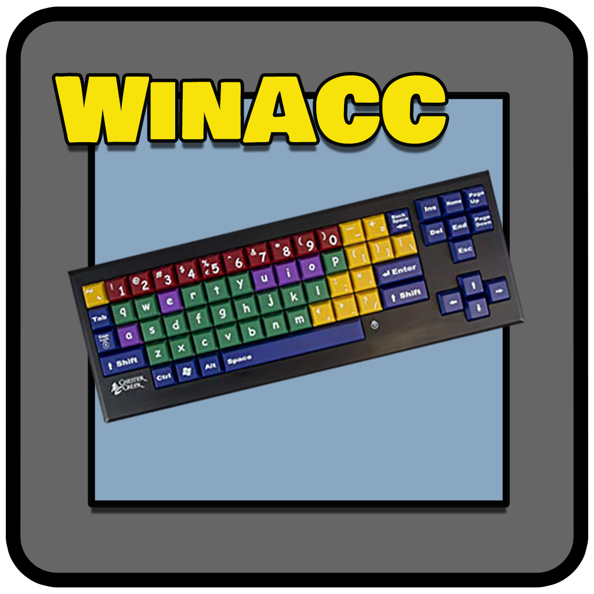
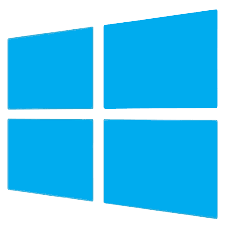

# WinACC
<TABLE><TR><TD>

 

<TABLE BORDER=0>
<TR>
<TD ALIGN=CENTER>  Windows 10 </TD>
<TD ALIGN=CENTER>  Windows 11 </TD>
</TR>
</TABLE>

## A program to write accents using a virtual keyboard
There are 2 architectures: 
- Windows 32 bit signed PE32  executable (win) Intel 80386 
- Windows 64 bit signed PE32+ executable (win) x86-64 

# Build notes
**x86/x64-Windows**: both 32/64 bits are built on Windows 10 64 bits using TDM-GCC (10.3.0) 

# Getting started
Get the last release clicking on the **Releases** button located on the **GitHUB** right panel 
or just click [here](https://github.com/uomoukko/WinACC/releases/). It's free for *personal use* 

# Running the executables
Use it like the Windows virtual keyboard. No need to change keyboard anymore.

# Build notes
**x86/x64-Windows**: both 32/64 bits are built on Windows 10 64 bits using TDM-GCC (10.3.0) 

# Bugs
Please contact me for bugs/improvements 
</TD></TR></TD></TABLE>
